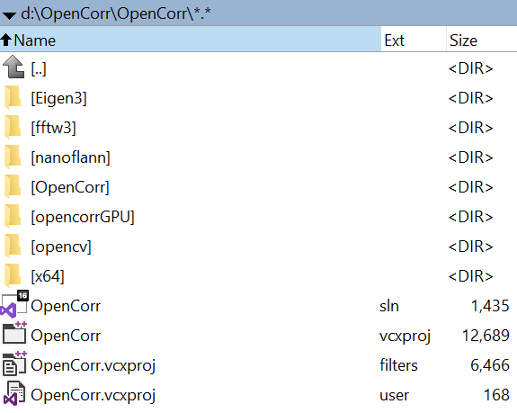
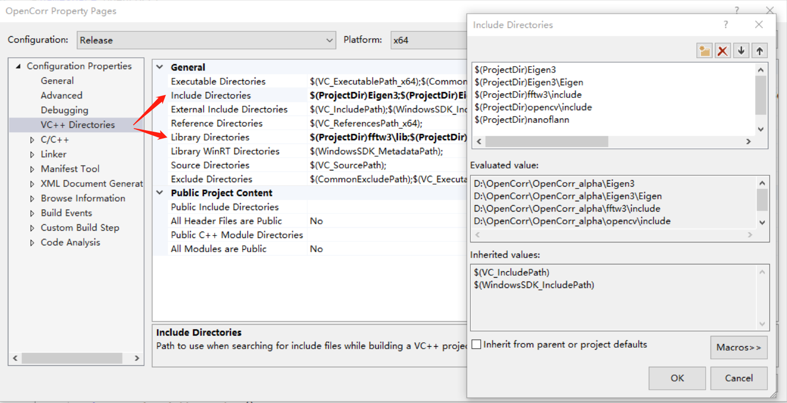
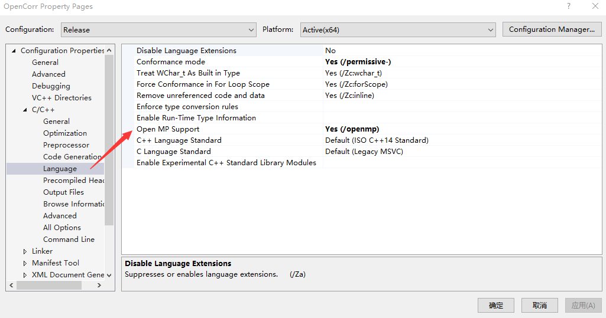

# 1. Get started

OpenCorr is developed and tested in Microsoft Visual Studio 2022 (VS, community version) on Windows 10. The codes follow the standard of ISO C++ 14, and can be compiled on other OS like Linux or using other C++ compiler like GCC. Developers working on Linux or Unix may refer to a sample of CMake script (/samples/CMakeLists.txt). To use this library, the users are supposed to have basic knowledge and skill about integrated development environment like VS. The building environment requires four freeware libraries:

- Eigen 3.4.0 ([eigen.tuxfamily.org](http://eigen.tuxfamily.org)), used for basic operations of matrix.
- OpenCV 4.6.0 ([opencv.org](http://opencv.org)), used to read images, extract and match the image features.
- FFTW 3.3.5 ([fftw.org](http://fftw.org)), used to speed up the calculation of cross correlation.
- nanoflann (https://github.com/jlblancoc/nanoflann), used to approximate nearest neighbors to a point among a point cloud.

These libraries provide excellent instructions for installation. The main procedure can be summarized as the following steps:

1. Download the source files (e.g., .h or .cpp), static library files (.lib), and dynamic link library files (.dll) from the websites;

2. Place them into proper directories in your computer. For example, I created a solution in VS with name of OpenCorr and a project with same name. The source codes are stored in folder "D:\OpenCorr\OpenCorr\", the files of source codes and static libraries of the three libraries are also placed in folder "D:\OpenCorr\", as shown in Figure 1.1;

   

   *Figure 1.1. An example of directory structure*

3. Set the paths of source files and static library files in VS, as illustrated in Figure 1.2;
   
   *Figure 1.2. Illustration of setting directories of libraries in Visual Studio 2019*

4. Set the additional dependencies in Project->Properties. Open the Additional Dependencies dialog, as shown in Figure 1.3;
   

   *Figure 1.3. Illustration of setting additional dependencies in Visual Studio 2019*

Then add the name list of static library files into the edit box. Beware that the file name ends with "d" in Debug mode for opencv libs.

>libfftw3-3.lib
>libfftw3f-3.lib
>libfftw3l-3.lib
>opencv_world460.lib

5. Place the dynamic link library files (.dll) into the folder where the executable programs are built (e.g., "D:\OpenCorr\x64\Release\", as shown in Figure 1.1), or the directories listed in system Path;

6. Set OpenMP support to enable the acceleration on multi-core CPU, as shown in Figure 1.4.
   
   *Figure 1.4. Illustration of setting OpenMP support in Visual Studio 2019*

To facilitate the configuration for beginners, we made a zip package of visual studio 2019 solution and share it on [opencorr.org](https://opencorr.org). Users may download and unzip it, then open OpenCorr.sln in VS 2019 or VS 2022, and start programming.

There are a few examples in the folder "samples" along with images, which demonstrate how to make a DIC program using the modules in OpenCorr. Before building the executables, make sure that the file paths in the codes are correctly set. 
