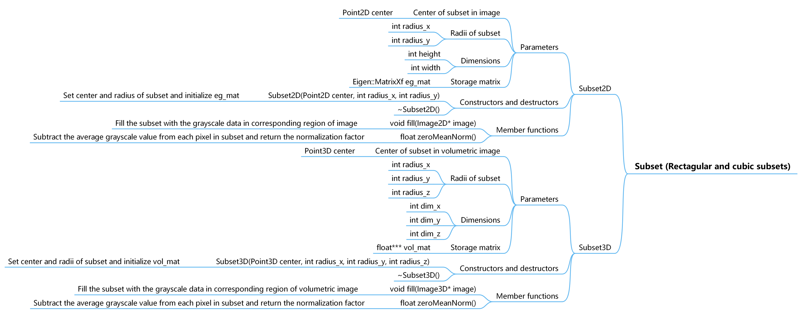
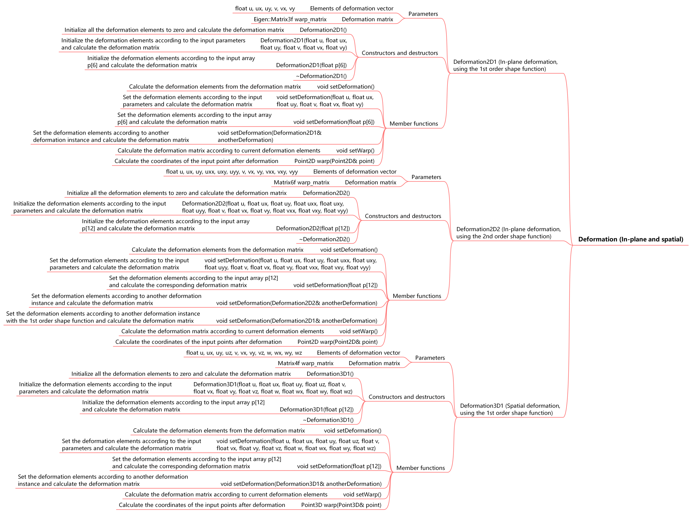

# 3. Data structures

### 3.1. Basic data:

(1) Point (oc_point.h and oc_point.cpp). Figure 3.1.1 shows the parameters and methods included in this object. The main parameter of point is its coordinate. It can also be regarded as a vector, indicating the offset from one point to another. Thus, a function (i.e. vectorNorm()) is provided to calculate the magnitude of the vector.  Moreover, operator "+" and "-" are overloaded to perform the superimposition of an offset on the coordinate of a point. Operator "\*" and "/" are used for the coordinate of a point multiplied or divided by a scalar. Moreover, Operator "\*" is also used to calculate the dot product of two point vectors, while operator "/" is used to calculate the cross product of two point vectors. Operator "<<" is overloaded to output the coordinate of a point, in the form of  "x, y" (Point2D) or "x, y, z" (Point3D).

*Figure 3.1.1. Parameters and methods included in Point object*

(2) Array/matrix (oc_array.h and oc_array.cpp). Figure 3.1.2 shows the parameters and methods included in this object. The object is simple, as the operations of matrix in this library call the functions of Eigen. It only contains the functions of create and delete 2D, 3D and 4D arrays, as well as the specifical definition of Eigen matrices and vectors.

*Figure 3.1.2. Parameters and methods included in Array object*

(3) Image (oc_image.h and oc_image.cpp). Figure 3.1.3 shows the parameters and methods included in this object. In 2D case, OpenCV function is called to read image file and get its dimension, as well as store the data into the Eigen matrices with same size. In 3D case, the volumetric image is stored as a binary file, which includes a head of three integer (dimension x, y, and z) and a 3D float array. The 3D array can also be regarded as an 1D array, with the data arranged in the order of dimension: x, y, and then z. Another file format can be used to store volumetric image is TIFF image consisting of multiple pages. Each page is treated as a layer in x-y plane.

*Figure 3.1.3. Parameters and methods included in Image object*

### 3.2. DIC data:

(1) Subset (oc_subset.h and oc_subset.cpp). Figure 3.2.1 shows the parameters and methods included in this object. Subset can be regarded as a special matrix with its center located at a specific point. Each dimension of a subset equals to two times of corresponding radius plus one.

Member functions:

- fill(Image2D* image) or fill(Image3D* image), read grayscale data in a specific region from an Image object and feed the data into the subset.
- zeroMeanNorm(), perform the zero mean normalization of grayscale value at every point in the subset and return the normalization factor.

*Figure 3.2.1. Parameters and methods included in Subset object*

(2) Deformation (oc_deformation.h and oc_deformation.cpp). Figure 3.2.2 shows the parameters and methods included in this object. Deformation includes two dimensional one and three dimensional one, which can be described using the first order shape function and the second order shape function. In 2D case, the 1st order shape function contains 6 elements (displacements u and v, as well as their gradients along x- and y-axis), its warp_matrix is a 3x3 matrix. The 2nd order shape function contains 12 elements (displacements u and v, as well as their first and second order gradients along x- and y-axis), its warp_matrix is a 6x6 matrix. In 3D case, the 1st order shape function contains 12 elements (displacements u, v and w, as well as their gradients along x-, y- and z-axis), its warp_matrix is a 4x4 matrix.

Member functions:

- setDeformation() without input, set the deformation elements according to current warp_matrix;
- setDeformation() with input, set the deformation elements according to the input, and update warp_matrix;
- setDeformation() with another Deformation instance as input, set the deformation elements and update warp_matrix, according to the given instance;
- setWarp(), update warp_matrix according to current deformation elements;
- Point2D warp(Point2D& point) or Point3D warp(Point3D& point), calculate the coordinates of a point experienced the deformation.

*Figure 3.2.2. Parameters and methods included in Deformation object*

(3) POI (Point of interest, oc_poi.h and oc_poi.cpp). Figure 3.2.3 shows the parameters and methods included in this object. POI inherits the properties and methods from Point object. In addition, it contains a deformation vector, a result vector and a strain vector. Vector deformation vector is used in DIC processing. Vector result stores the parameters for analysis, e.g. initial guess, ZNCC value, maximum norm of the deformation increment, numbers of iteration and image features around the POI. Vector strain stores the calculated strains. Especially, POI2DS is designed for 3D/stereo DIC, which inherits the properties from Point2D, but contains a three dimensional deformation vector of the zeroth order. Its result vector includes three ZNCC values in DIC processing and stereo matching, 2D coordinates of the POI in the two reference views and two target views, as well as a reconstructed 3D coordinates.

Member functions:

- clean(), set all the elements in deformation vector and result vector as zero.

*Figure 3.2.3. Parameters and methods included in POI object*
