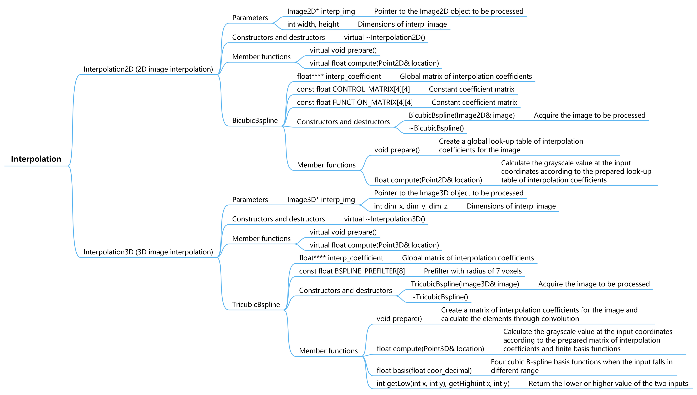
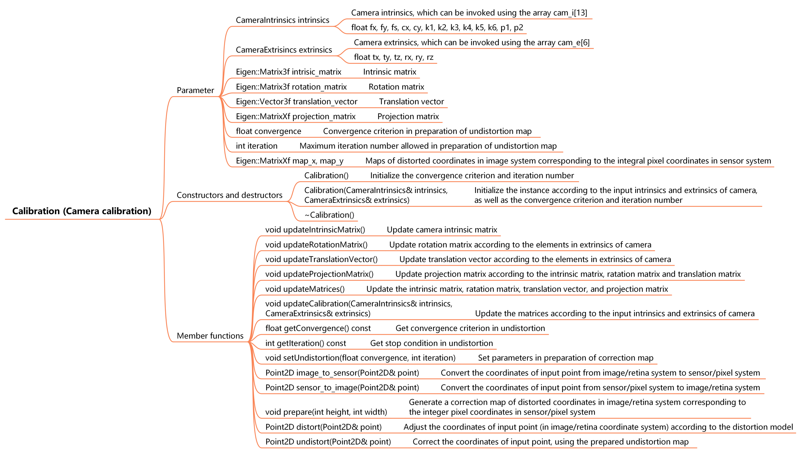
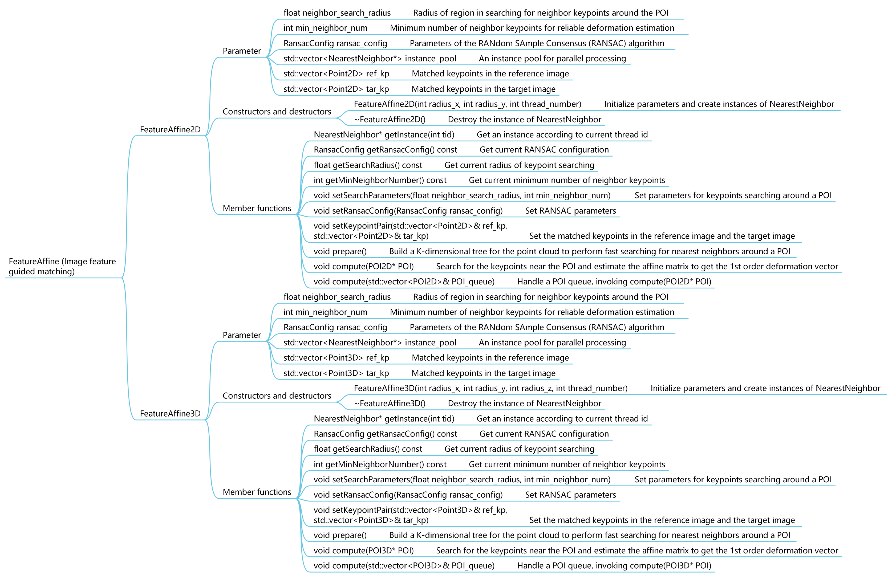

# 4. Processing methods

### 4.1. Basic processing:

(1) Gradient (oc_gradient.h and oc_gradient.cpp). Figure 4.1.1 shows the parameters and methods included in this object. OpenCorr currently provides only one gradient calculation method, i.e. the 4th-order central difference, which may be the most popular one. In 2D case, Pointer grad_img points to a Image2D object for processing. The gradient maps are stored in Eigen matrices gradient_x, gradient_y, and gradient_xy, respectively.

Member functions:

- getGradientX() and getGradientY(), calculate the 1st-order gradient map along x and y direction, respectively;
- getGradientXY(), calculate the mixed 2nd-order gradient map.

In 3D case, Pointer grad_img points to a Image3D object for processing. The gradient maps are stored in 3D float arrays gradient_x, gradient_y, and gradient_z, respectively.

Member functions:

- getGradientX(), getGradientY() and getGradientZ(), calculate the 1st-order gradient map along directions x, y and z, respectively.

*Figure 4.1.1. Parameters and methods included in Gradient object*

(2) Interpolation (oc_interpolation.h and oc_interpolation.cpp). Figure 4.1.2 shows the parameters and methods included in this object. Interpolation is a base class which contains essential parameter, i.e. interp_img pointing to the Image object for processing. The derived classes BicubicBspline and TricubicBspline (oc_cubic_bspline.h and oc_cubic_bspline.cpp) implement the popular cubic B-spline interpolation method for 2D and 3D cases. Our study indicates that the bicubic B-spline interpolation shows significantly improved accuracy and precision compared with the bicubic interpolation, at a trial computational cost (Pan et al. Theo Appl Mech Lett, 2016, 6(3):126-130). Details of TricubicBspline can be found in our DVC paper (Yang et al. Opt Laser Eng, 2021, 136:106323).

Member functions:

- prepare() constructs a global matrix of interpolation coefficients of interp_img;
- compute(Point2D& location) or compute(Point3D& location), estimates the grayscale value at the input location.

*Figure 4.1.2. Parameters and methods included in Interpolation object*

(3) NearestNeighbor (oc_nearest_neighbors.h and oc_nearest_neighbors.cpp). Figure 4.1.3 shows the parameters and methods included in this object. It calls nanoflann (https://github.com/jlblancoc/nanoflann) to approximate the nearest neighbors of a given coordinates among a 3D point cloud. The flann demonstrates considerably superior efficiency over the brute force searching. Two searching modes are provided by the library: (i) search in a circular region with a specific radius; (ii) search for K-nearest neighbors. It is noteworthy that NearestNeighbor may not get all of eligible neighbors occasionally. Users may try brute force search if the number of obtained neighbors are far below the request.

Member function:

- assignPoints(), assign a Point2D or Point3D queue to make a 3D point could;
- constructKdTree(), construct a K-dimensional tree for fast searching;
- radiusSearch(Point3D query_point), approximate the nearest neighbors to the coordinates of a given 3D point within a region of specific radius, return the number of obtained neighbors;
- knnSearch(Point3D query_point), approximate the K nearest neighbors to the coordinates of a given 3D point, return the number of obtained neighbors;
- getSearchRadius() and getSearchK(), get current parameters in the two searching modes;
- setSearchRadius(float search_radius) and setSearchK(int search_k), set the parameters in the two searching modes.

*Figure 4.1.3. Parameters and methods included in NearestNeighbor object*

(4) Feature (oc_feature.h and oc_feature.cpp). Figure 4.1.4 shows the parameters and methods included in this object. Feature is a base class which contains essential parameters, i.e. ref_img and tar_img pointing to the Image2D objects (reference image and target image). The derived class SIFT2D (oc_sift.h and oc_sift.cpp) provides the method to extract and match the SIFT features in the two images. Structure sift_config contains the main paramters in feature extraction. Users may refer to the relevant documents of OpenCV for their meanings. Parameter matching_ratio is the threshold of ratio of the shortest distance betweeen the descriptors of reference feature and target feature to the second shortest distance. The details about this parameter can be found in Lowe's famous paper (Lowe, Int J Comput Vis, 2004, 60(2):91-110). The extracted keypoints, after matching, are stored in the queues ref_matched_kp and tar_matched_kp.

Member functions include:

- setImages(Image2D& ref_img, Image2D& tar_img), set ref_img and tar_img;
- prepare(), assign the address of matrices in ref_img and tar_img to OpenCV matrices ref_mat and tar_mat;
- compute(), extract the features in reference image and target image, and then match them;
- getSiftConfig(), get current configuration of feature extraction;
- getMatchingRatio(), get current match ratio threshold of feature matching;
- setSiftCong(SiftConfig sift_config), set configuration of feature extraction;
- setMatching(float matching_ratio), set matching ratio threshold of feature matching.

*Figure 4.1.4. Parameters and methods included in Feature object*

(5) Calibration (oc_calibration.h and oc_calibration.cpp). Figure 4.1.5 shows the parameters and methods included in this object. It is used to undistort the pixel coordinates of a 2D point in sensor coordinate system.

Parameters:

- Camera intrinsics, including fx, fy, fs, cx, cy, k1, k2, k3, k4, k5, k6, p1, p2;
- Camera extrinsics, including tx, ty, tz, rx, ry, rz;
- Intrinsic matrix: intrinsic_matrix;
- Rotation matrix: rotation_matrix;
- Translation vector: translation_vector;
- Projection matrix: projection_matrix;
- Convergence criterion and stop condition: convergence and maximum iteration number in preparation of undistortion map;
- Map of distorted coordinates in image/retina coordinate system corresponding to the integral pixel coordinates in sensor/pixel system: map_x, map_y.

Member functions:

- updateIntrinsicMatrix(), update camera intrinsic matrix;
- updateRotationMatrix(), update rotation matrix;
- updateTranslationVector(), update translation vector;
- updateProjectionMatrix(), update projection matrix according to the three matrices mentioned above;
- Point2D image_to_sensor(Point2D& point), convert the coordinates of input point from image/retina system to sensor/pixel system;
- Point2D sensor_to_image(Point2D& point), convert the coordinates of input point from sensor/pixel system to image/retina system;
- setUndistortion(float convergence, int iteration), set parameters in preparation of undistortion map;
- prepare(int height, int width), create a map of distorted coordinates in image/retina system corresponding to the integral pixel coordinates in sensor/pixel system, according to the size of image;
- Point2D distort(Point2D& point), adjust the coordinates of input point (in image/retina coordinate system) according to the distortion model;
- Point2D undistort(Point2D& point), correct the coordinates in sensor system of input point using the prepaed map and linear interpolation.

*Figure 4.1.5. Parameters and methods included in Calibration object*

(6) Stereovision (oc_stereovision.h and oc_stereovision.cpp). Figure 4.1.6 shows the parameters and methods included in this object. It is used to reconstruct the coordinates of a 3D point in space based on the two matched 2D points in left view and right view.

Parameters:

- Calibration objects of the two cameras: view1_cam (principal), view2_cam (secondary);
- Number of CPU threads in parallel processing: thread_number;

Member functions:

- updateCameraParameters(Calibration* view1_cam, Calibration* view2_cam), update the objects of cameras;
- prepare(), update the parameter matrices of the two cameras;
- Point3D reconstruct(Point2D& view1_2d_point, Point2D& view2_2d_point), reconstruct the coordinates of 3D point based on the mtatched 2D points in view1 and view2.
- reconstruct(view1_2d_point_queue,  view2_2d_point_queue, space_3d_point_queue), handle a batch of point pairs, the results are stored in space_3d_point_queue.

*Figure 4.1.6. Parameters and methods included in Stereovision object*

(7) IO (oc_io.h and oc_io.cpp). Figure 4.1.7 shows the parameters and methods included in this object. It helps developers during code debugging. Users can load information of POIs from CSV datasheet or save the computed results into CSV datasheets.

Parameters:

- File path and delimiter of data: file_path, delimiter;
- Image dimensions: 2D (height, width), 3D (dim_x, dim_y, dim_z);

Member functions:

- setPath(string file_path), set path of CSV datasheet;
- setDelimiter(string delimiter), set delimiter for data picking
- loadTable2D() or loadTable3D(), load computed results at POIs from a CSV datasheet, create a POI2D or POI3D queue;
- loadPoint2D() or loadPoint3D(), load coordinates of POIs from a CSV datasheet, create a Point2D or Point3D queue;
- loadTable2DS(), load computed results at POIs from a CSV datasheet, create a POI2DS queue;
- saveTable2D(vector<POI2D> poi_queue) or saveTable3D(vector<POI3D> poi_queue)，save the information of POIs into csv datasheet;
- saveDeformationTable2D(vector<POI2D> poi_queue), save the full deformation vectors of POIs into a CSV datasheet;
- saveMap2D(vector<POI2D> poi_queue, char variable), save specific information of POIs (2D DIC results) into a 2D map according to the coordinates of POIs, variable can be set as 'u', 'v', 'c'(zncc), 'd'(convergence), 'i'(iteration), 'f'(feature), 'x' (exx), 'y' (eyy), 'r' (exy);.
- saveTable2DS(vector<POI2DS> poi_queue), specifically for Stereo/3D DIC, save the computed results of POIs into a CSV datasheet;
- saveMap2DS(vector<POI2DS>& poi_queue, char variable), save specific information of POIs (3D/stereo DIC results) into a 2D map according to the coordinates of POIs, variable can be set as 'u', 'v', 'w', 'c'(r1r2_zncc), 'd'(r1t1_zncc), 'e'(r1t2_zncc), 'x' (exx), 'y' (eyy), 'z' (ezz), 'r' (exy) , 's' (eyz), 't' (ezx);
- saveMatrixBin(vector<POI3D>& poi_queue), save the information of POIs into a binary file. The binary file begins with four integers (data length and three dimensions), followed with an array of floats.

*Figure 4.1.7. Parameters and methods included in IO object*

### 4.2. DIC/DVC processing:

The base class DIC (oc_dic.h and oc_dic.cpp) contains a few essential parameters:

- Pointer of reference image and target image: ref_img 和 tar_img;
- Subset radii (in x, y and z direction): subset_radius_x, subset_radius_y, subset_radius_z;
- Number of CPU threads in parallel processing: thread_number.

Member functions:

- setImages(Image2D& ref_img, Image2D& tar_img) or setImages(Image3D& ref_img, Image3D& tar_img), set the pointers of ref_img and tar_img;

- setSubsetRadii(int subset_radius_x, int subset_radius_y) or setSubsetRadii(int subset_radius_x, int subset_radius_y, int subset_radius_z), set subset radii.
- prepare(), preparation for DIC or DVC processing;
- compute(POI2D* poi) or compute(POI3D* poi), process single POI;
- compute(std::vector& poi_queue), handle a batch of POIs by calling compute(POI2D* POI) or compute(POI3D* poi).

It is noteworthy that the methods in derive classes are designed for path-independent DIC and DVC, but they can also be employed to realize the DIC/DVC methods with initial guess transfer mechanisms. For example, the popular reliability-guided DIC can be readily implemented by combining C++ vector and its sort functions with the DIC methods listed below.

(1) FFTCC (oc_fftcc.h and oc_fftcc.cpp), fast Fourier transform (FFT) accelerated cross correlation. Figure 4.2.1 shows the parameters and methods included in this object. The method calls FFTW library to perform FFT and inverse FFT computation. Its principle can be found in our paper (Jiang et al. Opt Laser Eng, 2015, 65:93-102). An auxiliary class FFTW is made to facilitate parallel processing, as the procedure need allocate quite a lot of memory blocks dynamically. During the initialization of FFTCC2D or FFTCC3D, a few FFTW instances are created according to the input thread_number. Afterwards, they are called in compute(POI2D* POI) or compute(POI3D* POI) through getInstance(int tid). FFTCC can also be used to determine the average speckle size in a subset or an image through auto-correlation (see funcion determineSpeckleSize() for details). 

*Figure 4.2.1. Parameters and methods included in FFTCC2D object*

(2) FeatureAffine (oc_feature_affine.h and oc_feature_affine.cpp), image feature aided affine estimation. Figure 4.2.2 shows the parameters and methods included in this object. The method estimates the affine matrix according to the keypoints around a POI in order to get the deformation at the POI. Users may refer to our paper (Yang et al. Opt Laser Eng, 2020, 127:105964) for the details of principle and implementation. It is noteworthy at those POIs with few keypoints nearby, the searching for neighbor kepoints continues out of the predefined region until the number reaches the set minimun value.

*Figure 4.2.2. Parameters and methods included in FeatureAffine2D object*

(3) ICGN (Inverse compositional Gauss-Newton algorithms with the 1st-order shape function and the 2nd-order shape function), codes are stored in oc_icgn.h and oc_icgn.cpp. Figure 4.2.3 show the parameters and methods included in the object. The principle and implementation of ICGN2D1 and ICGN3D1can be found in our papers (Jiang et al. Opt Laser Eng, 2015, 65:93-102; Wang et al. Exp Mech, 2016, 56(2):297-309). Users may refer to the paper by Professor ZHANG Qingchuan's group (Gao et al. Opt Laser Eng, 2015, 65:73-80) for the detailed information of ICGN2D2. Auxiliary classes (e.g. ICGN2D1, ICGN2D2_  and ICGN3D1_) are made for parallel processing because the procedures also require a lot of dynamically allocated memory blocks. The implementation and usage of the auxiliary classes are similar to the ones in FFTCC.

*Figure 4.2.3. Parameters and methods included in ICGN object*

(4) EpipolarSearch (oc_epipolar_search.h and oc_epipolar_search.cpp), epipolar constraint aided search for stereo matching. Figure 4.2.4 shows the parameters and methods included in this object. The method uses the epipolar constraint between the two views to search the counterpart (in view2) of a point (in view1), narrowing the searching range within a part of epipolar line. The searching range centered at the intersection of epipolar line and its normal line crossing a point estimated according to an initial displacement and a guess of parallax. The searching step is limited to a couple pixels (less than the convergence radius of ICGN algorithms). Users may refer to our paper (Lin et al. Opt Laser Eng, 2022, 149:106812) for details of principle and implementation. This method calls ICGN2D1 method with lenient convergence criterion and less iteration to guarantee roughly accurate matching in trials, and reserve the result with highest ZNCC value, which can be fed into ICGN2D2 method for high accuracy matching. A simple example (test_3d_reconstruction_epipolar.cpp in folder /samples) demonstrates the reconstruction of a 3D point cloud using this method. Another example (test_3d_reconstruction_epipolar_sift.cpp in folder /samples) demonstrates how combine the EpipolarSearch method and SIFT features to achieve a significantly improved efficiency.

Parameters:

- Instances of two cameras: view1_cam (principal) and view2_cam (secondary);
- Fundamental matrix to locate epipolar line: fundamental_matrix；
- Parameters in stepped searching: search_radius, search_step;
- Parallax between the two views, which is supposed to follow a bilinear distribution with respect to the location of POI: parallax_x[3], parallax_y[3];

*Figure 4.2.4. Parameters and methods included in EpipolarSearch object*

(5) Strain (oc_strain.h and oc_strain.cpp), calculation of the strains on measured surface based on the displacements obtained by DIC. Figure 4.2.5 shows the parameters and methods included in this objects. The method first creates local profiles of displacement components in a POI-centered subregion through polynomial fitting, and then calculates the Green-Lagrangian strains according to the first order derivatives of the profile. Users may refer to the paper by Professor PAN Bing (Pan et al. Opt Eng, 2007, 46:033601) for the details of principle.

Parameters:

- Radius of subregion for local dispacement profile fitting: subregion_radius;
- Minimum number of neighbor POIs involved in facet fitting: min_neighbor_num;
- Lowest ZNCC value required for the neighbor POIs involved in facet fitting: zncc_threshold;
- Description of strain tensor: description, 1 denotes Lagrangian; 2 denotes Eulerian;
- POI queue for processing: std::vector<POI2D> poi2d_queue for 2D DIC, std::vector<POI2DS> poi2ds_queue for 3D/stereo DIC, std::vector<POI3D> poi3d_queue for DVC.

Member functions:

- setSubregionRadius(int subregion_radius), set the radius of the POI-centerd subregion for fitting of local displacement profiles;
- setMinNeighborNumber(int min_neighbor_num), set minimum number of neighbor POIs;
- setZnccThreshold(float zncc_threshold), set ZNCC threshold;
- setDescription(int description), set description of strain tensor: 1 denotes Lagrangian; 2 denotes Eulerian;
- void setPoiQueue(poi_queue), set POI queue for processing, the element of vector should be POI2D in 2D DIC, POI2DS in 3D/stereo DIC, and POI3D in DVC;
- compute(POI2D* poi), compute(POI2DS* poi), or compute(POI3D* poi), calculate the strains at a POI;
- compute(std::vector& poi_queue), handle a queue of POIs, calling compute(poi).

*Figure 4.2.5. Parameters and methods included in Strain object*
