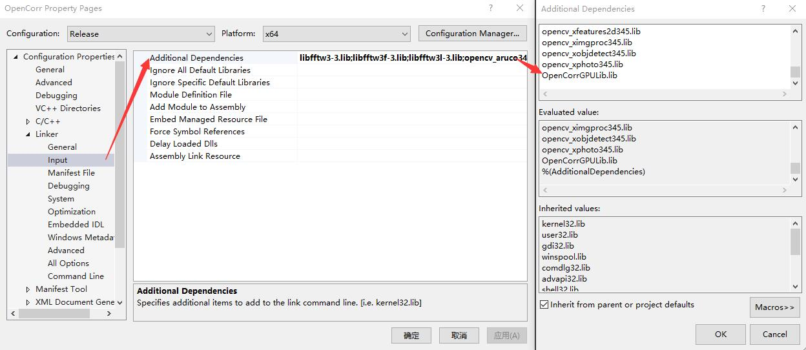

# 5. GPU acceleration

GPU accelerated modules currently include a module of ICGN2D algorithm with shape functions of the 1st and the 2nd order. Developers can use them through calling dynamic link library.
Requirements:

- Hardware: NVIDIA graphics card with memory greater than 2GB
- Software: Windows OS, CUDA ToolKit 11.4

GPU accelerated ICGN module consists of three files: head (opencorr_gpu.h), static library (OpenCorrGPULib.lib), and dynamic link library (OpenCorrGPULib.dll). The configuration in VS can be summarized as four steps:

1. Place opencorr_gpu.h into the folder where opencorr.h is, as shown in Figure 5.1. Then, add the following lines into the cpp file:

   > #include "opencorr_gpu.h";
   >
   > using namespace opencorr_gpu;
   >

   

   *Figure 5.1. Placing opencorr_gpu.h in the same folder of opencorr.h*

2. Set the path of static library file in VS (for example, OpenCorrGPULib.lib is in folder opencorrGPU\lib in Figure 1.1), as illustrated in Figure 5.2;

   

   *Figure 5.2. Setting directory of library in Visual Studio 2019*

3. Add OpenCorrGPULib.lib as the additional dependencies, as illustrated in Figure 5.3;

   

   *Figure 5.3. Setting additional dependency of library in Visual Studio 2019*

4. Place OpenCorrGPULib.dll in the same folder of the built executable program (.exe).

test_2d_dic_gpu_icgn2.cpp in folder /examples demonstrates how to use the module. The data structures in this module are a little different from those in OpenCorr (CPU version) to achieve high computation efficiency. Thus, the reference image and the target image need to be converted to 1D arrays. An additional POI queue is generated and assigned with the location and initial guess for each POI. After the processing, the obtained results need to be transferred back to the original POI queue for the convenience of output by invoking other modules in OpenCorr.
